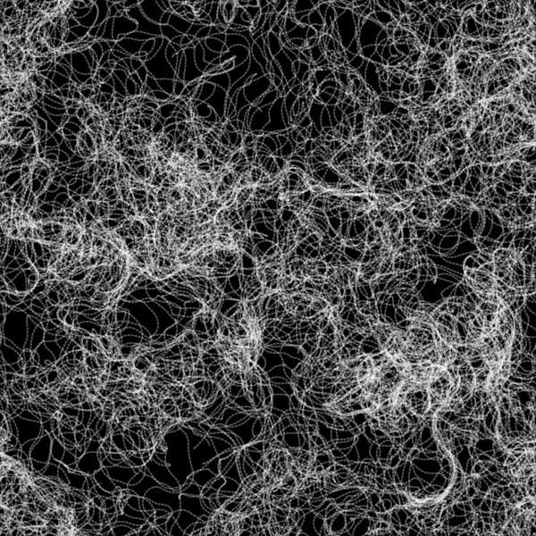
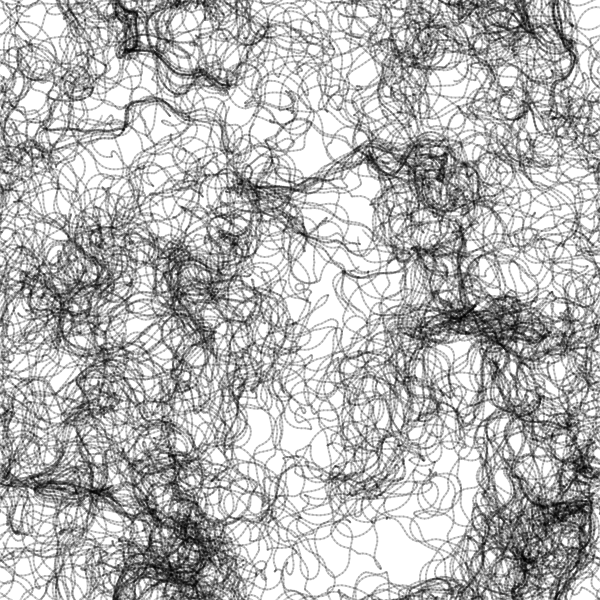

# Perlin Noise

Perlin Noise is a type of gradient developed to produce natural appearing textures on computer generated surfaces.

## References
Daniel Shiffman's [The Nature of Code](https://natureofcode.com/book/)
